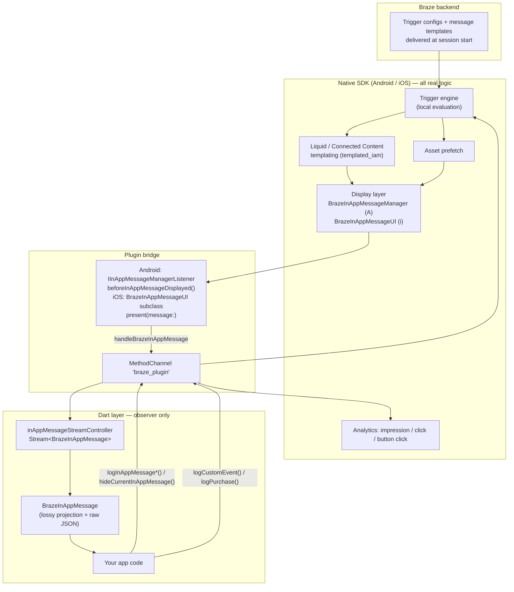

# How Braze Handles In-App Messages (Flutter SDK)

Behavioural reference for extending the Gameball Flutter SDK with in-app messaging.

> **Scoped to the Braze *Flutter* plugin. Do not reuse it as the reference for a native port.**
> That plugin is a thin bridge over two native SDKs which own all the real logic, and its display
> hooks are unreachable from Dart — so several conclusions here ("Braze cannot expose X") are true of
> the plugin and false of the product. An iOS port benchmarks against
> [`braze-swift-sdk`](https://github.com/braze-inc/braze-swift-sdk), Android against
> [`braze-android-sdk`](https://github.com/braze-inc/braze-android-sdk). See §0.5 of
> [`../reference/in-app-messaging-port-specification.md`](../reference/in-app-messaging-port-specification.md)
> for what changes when the reference changes.

## Scope and sources

Everything below is derived from two kinds of source, and each claim is tagged so you
can tell them apart:

| Tag | Meaning |
| --- | --- |
| **[src]** | Read directly out of the Braze Flutter SDK source, with `file:line` |
| **[doc]** | From Braze's public documentation (product/dashboard behaviour the SDK can't show) |

- **Repo:** `github.com/braze-inc/braze-flutter-sdk`
- **Version:** `braze_plugin` 21.0.0 (`pubspec.yaml:3`), latest tag at time of writing
- **Commit:** `ecdde249fd162a47270edbb637e8ec6904fae2da` (2026-07-13)
- **Native bridges at this version:** Braze Swift SDK 17.0.0, Braze Android SDK 42.3.1 (`CHANGELOG.md:3`, `:26`)

Docs consulted: [Flutter in-app messages](https://www.braze.com/docs/developer_guide/in_app_messages/?sdktab=flutter),
[Triggering messages](https://www.braze.com/docs/developer_guide/in_app_messages/triggering_messages),
[Customization](https://www.braze.com/docs/developer_guide/in_app_messages/customization?sdktab=flutter),
[Message types](https://www.braze.com/docs/user_guide/message_building_by_channel/in-app_messages/traditional/create/).

---

## 1. The single most important fact

**Braze's Flutter SDK does not render in-app messages in Flutter.** It is a thin
bridge. Every message is composed, triggered, templated, laid out, animated,
presented and dismissed by the **native** Android/iOS Braze SDKs. The Dart layer
receives a **read-only JSON copy** of each message as a side-effect of the native
display pipeline, and can log analytics against it.

Contrast this with Braze **Banner Cards**, where the SDK *does* ship a Flutter
widget — `BrazeBannerView` (`lib/braze_plugin.dart:1618`), a platform view
wrapping a native web view. Braze made a deliberate, differing choice per channel:
banners are embedded in your Flutter tree, in-app messages are not.

### The integration levels — and whose idea each one is

Braze supports two of these. The third is this document's reconstruction, so it is
labelled as such wherever it appears.

| Level | Whose | What it means |
| --- | --- | --- |
| **1. Zero-code display** | **Braze's, documented.** Their term: *"automatic integration"* | Native shows the message; Dart optionally observes it. What nearly every Braze Flutter customer uses. |
| **2. Customized native rendering** | **Braze's, documented.** | You keep native display but replace views, wrappers or animations — `IInAppMessageViewFactory`, `IInAppMessageViewWrapperFactory`, `IInAppMessageAnimationFactory` on Android; `BrazeInAppMessageUIDelegate` or a `BrazeInAppMessageUI` subclass on iOS. Custom **native** views, written in Kotlin/Swift. This is Braze's actual answer to "make it look different." |
| **3. Flutter take-over** | **Not Braze's.** Assembled here from Braze primitives; see §5. | Suppress native display entirely and re-render the message in Flutter widgets. |

Level 1 is Braze's documented default: *"The Braze Flutter SDK automatically sets up
the default in-app message presenter on both Android and iOS."* **[doc]**

Level 3's ingredients are all real, documented Braze APIs — Android `DISCARD`
(`CHANGELOG.md:495-500`), the iOS custom presenter, and the public
`processInAppMessage` — but **Braze nowhere presents Flutter rendering as a
supported option**, and their own example presenter always calls
`super.present(message:)`. Treat §5 as a derived path, not a sanctioned one.

Common to levels 2 and 3: **both require native Kotlin and Swift.** There is no
pure-Dart path to changing how or whether a message displays.

---

## 2. Architecture



Read the arrows carefully. Dart's only inputs to the system are (a) events that
*may* fire a trigger, and (b) analytics and dismissal calls about a message it was
handed. It never decides *whether*, *when*, or *how* a message appears.

---

## 3. What an integrator actually writes

### 3.1 Android — pure configuration, no code

```xml
<!-- android/app/src/main/res/values/braze.xml -->
<resources>
  <string translatable="false" name="com_braze_api_key">YOUR_API_KEY</string>
  <string translatable="false" name="com_braze_custom_endpoint">YOUR_ENDPOINT</string>
</resources>
```

That's it for in-app messages. **[src]** `BrazePlugin.onAttachedToActivity`
(`android/src/main/kotlin/com/braze/brazeplugin/BrazePlugin.kt:124-133`) runs an
"automatic integration" on first activity attach:

```kotlin
if (IntegrationInitializer.isUninitialized &&
    flutterConfiguration.isAutomaticInitializationEnabled()
) {
    this.activity?.application?.let {
        IntegrationInitializer.initializePlugin(it, flutterConfiguration)
    }
}
```

`IntegrationInitializer.initializePlugin` (`IntegrationInitializer.kt:25-40`) then:

- registers `BrazeActivityLifecycleCallbackListener` (session tracking + IAM host activity)
- subscribes to content cards, banners, feature flags, push events
- installs the IAM hook:

```kotlin
BrazeInAppMessageManager.getInstance()
    .setCustomInAppMessageManagerListener(
        BrazeInAppMessageManagerListener(
            config.automaticIntegrationInAppMessageOperation()
        )
    )
```

Two Android XML resource keys control this **[src]** (`FlutterConfiguration.kt:47-52`):

| Resource | Type | Default | Effect |
| --- | --- | --- | --- |
| `com_braze_flutter_enable_automatic_integration_initializer` | bool | `true` | Set `false` to skip the whole automatic wiring and do it yourself |
| `com_braze_flutter_automatic_integration_iam_operation` | string | `DISPLAY_NOW` | Return value of `beforeInAppMessageDisplayed` |

That second key is the **only declarative suppression switch in the entire SDK**,
and it is Android-only. Braze introduced it explicitly for this purpose
(`CHANGELOG.md:495-500`: *"Adds the ability to restrict the Android automatic
integration from natively displaying in-app messages"*).

Mind a **docs/code discrepancy** on its accepted values. The changelog states *"The
available options are `DISPLAY_NOW` or `DISCARD`"* — but the code builds its lookup
from `InAppMessageOperation.values()` (`FlutterConfiguration.kt:41, 51`), so
`DISPLAY_LATER` is also accepted and honoured. It works, it is simply undocumented;
don't build on it without pinning the SDK version.

### 3.2 iOS — requires Swift

```swift
// AppDelegate.swift
BrazePlugin.configure(
  { configuration in
    configuration.sessionTimeout = 1
    configuration.triggerMinimumTimeInterval = 0   // IAM rate limit, see §7.3
  },
  postInitialization: { braze in
    braze.inAppMessagePresenter = CustomInAppMessagePresenter()   // optional
  }
)
```

**[src]** `BrazePlugin.configure(_:postInitialization:)`
(`ios/braze_plugin/Sources/braze_plugin/BrazePlugin.swift:1033-1040`) calls
`Braze.prepareForDelayedInitialization()` and stashes both closures. The instance
is created later, when Dart calls `initialize(apiKey, endpoint)`
(`BrazePlugin.swift:91-107`). An eager alternative, `BrazePlugin.initBraze(config)`
(`:1103`), still exists and is what the README shows.

If you supply no presenter, **[src]** `BrazeSubscriptionManager.subscribeToAllChannels`
(`BrazeSubscriptionManager.swift:17-33`) installs the default one:

```swift
brazeClient.setDefaultPresenter { inAppMessage in
  BrazePlugin.processInAppMessage(inAppMessage)
}
```

which resolves to **[src]** (`BrazeFlutterClient.swift:64-76`):

```swift
class DefaultFlutterInAppMessagePresenter: BrazeInAppMessageUI {
  override func present(message: Braze.InAppMessage) {
    processAction(message)        // → forward to Dart
    super.present(message: message)  // → native display
  }
}
```

Note `configuration.api.addSDKMetadata([.flutter])` at `BrazePlugin.swift:1070` —
Braze tags the wrapper platform on every request.

### 3.3 Dart

```dart
final braze = BrazePlugin(
  inAppMessageHandler: (BrazeInAppMessage m) { /* observe */ },
  customConfigs: {replayCallbacksConfigKey: true},
);
braze.initialize(apiKey, endpoint);   // required on iOS delayed-init path
braze.changeUser('user-123');
braze.logCustomEvent('added_to_cart'); // may fire a trigger
```

**[src]** The constructor (`lib/braze_plugin.dart:96-132`) wires handlers, installs
the method-call handler, signals readiness, and syncs log level — in that order.
Handlers can equally be attached later via `subscribeToInAppMessages`.

---

## 4. The display pipeline, end to end

1. Dart calls `logCustomEvent` / `logPurchase`, or a session starts, or a push is clicked.
2. Native trigger engine matches locally against configs already on device (§7).
3. For a `templated_iam`, native fetches the templated content; for `inapp`, it uses the pre-templated payload.
4. Native decides to display and calls the plugin's hook.
5. **Hook forwards a JSON copy to Dart** and returns a display decision.
6. Native renders, animates, handles the click action, and dismisses.
7. Native logs impression/click **for messages it displayed**.

Step 5 is where the two platforms diverge, and the divergence is the single
biggest gotcha in Braze's Flutter surface.

### 4.1 Android hook

**[src]** `IntegrationInitializer.kt:100-114`:

```kotlin
private class BrazeInAppMessageManagerListener(
    val defaultInAppMessageOperation: InAppMessageOperation
) : DefaultInAppMessageManagerListener() {
    override fun beforeInAppMessageDisplayed(
        inAppMessage: IInAppMessage
    ): InAppMessageOperation {
        super.beforeInAppMessageDisplayed(inAppMessage)
        BrazePlugin.processInAppMessage(inAppMessage)
        return defaultInAppMessageOperation
    }
}
```

Forwarding and display are **decoupled** — the return value is read from XML, so
you can forward to Dart while returning `DISCARD`.

### 4.2 iOS hook

**[src]** `BrazeFlutterClient.swift:71-74` (shown above). Forwarding and display
are **hard-wired together** by `super.present(message:)`. The only way to separate
them is to write your own `BrazeInAppMessageUI` subclass and not call `super`.

### 4.3 The asymmetry, stated plainly

| | Android | iOS |
| --- | --- | --- |
| Hook point | `IInAppMessageManagerListener.beforeInAppMessageDisplayed` | `BrazeInAppMessageUI.present(message:)` override |
| Forwards to Dart | Yes, always (if a plugin is attached) | Yes, always |
| Suppress native display | **XML resource**, no code | **Swift subclass** in `postInitialization` |
| Defer for later | `DISPLAY_LATER` — native re-enqueues | `.reenqueue` via `BrazeInAppMessageUIDelegate` **[doc]** |
| Discard | `DISCARD` | omit `super.present` |
| Reachable from Dart | No | No |

**Consequence:** an app that wants Flutter-rendered messages must ship native code
on iOS and an XML resource on Android, and keep the two in sync. Braze never closed
this gap in the Flutter layer.

---

## 5. Rendering it yourself (the take-over path)

> **Provenance:** this section is **not a Braze-supported flow.** Every primitive
> below is a real, documented Braze API, but Braze never presents "render in Flutter"
> as an option — their documented customization story is custom *native* views
> (level 2 in §1). The `DartOnlyPresenter` below, and specifically the omission of
> `super.present(message:)`, are this document's construction; Braze's own example
> presenter always calls `super`. Verify against your target SDK version before
> relying on it.

**Android** — `res/values/braze.xml`:

```xml
<string translatable="false"
        name="com_braze_flutter_automatic_integration_iam_operation">DISCARD</string>
```

**iOS** — `AppDelegate.swift`:

```swift
class DartOnlyPresenter: BrazeInAppMessageUI {
  override func present(message: Braze.InAppMessage) {
    BrazePlugin.processInAppMessage(message)   // forward only; no super call
  }
}
// ...
postInitialization: { braze in braze.inAppMessagePresenter = DartOnlyPresenter() }
```

**Dart** — you now own everything: layout per `messageType`, image loading from
`imageUrl`, HTML rendering from `zippedAssetsUrl`, button rows from `buttons`,
auto-dismiss from `duration`, click-action routing from `clickAction`/`uri`, and
**every analytics call** (`logInAppMessageImpression`, `logInAppMessageClicked`,
`logInAppMessageButtonClicked`).

The catch: the Dart model is lossy (§6.2). Colours, text alignment, image crop
style and orientation never reach Dart, so a Dart-rendered message **cannot honour
the styling a marketer configured in the dashboard**. You would be reimplementing
the visual design in Flutter and ignoring the dashboard's styling controls — or
smuggling styling through `extras` key-value pairs.

---

## 6. Data model

### 6.1 Wire format

Android serialises via `inAppMessage.forJsonPut()` (`BrazePlugin.kt:969-970`), iOS
via `inAppMessage.json()` (`BrazePlugin.swift:1113-1123`). Both produce the native
message JSON, passed as a **string** under key `inAppMessage`.

**[src]** Full payload, from the plugin's own fixture (`test/fixtures/test_data.dart:83-121`):

```json
{
  "message": "body body",
  "type": "MODAL",
  "text_align_message": "CENTER",
  "click_action": "NONE",
  "message_close": "SWIPE",
  "extras": { "test": "123", "foo": "bar" },
  "header": "hello",
  "text_align_header": "CENTER",
  "image_url": "https://cdn.braze.com/.../original.jpg",
  "image_style": "TOP",
  "btns": [
    { "id": 0, "text": "button 1", "click_action": "URI",
      "uri": "https://www.google.com", "use_webview": true,
      "bg_color": 4294967295, "text_color": 4279990479, "border_color": 4279990479 },
    { "id": 1, "text": "button 2", "click_action": "NONE",
      "bg_color": 4279990479, "text_color": 4294967295, "border_color": 4279990479 }
  ],
  "close_btn_color": 4291085508,
  "bg_color": 4294243575,
  "frame_color": 3207803699,
  "text_color": 4280624421,
  "header_text_color": 4280624421,
  "trigger_id": "NWJhNTMxOThiZjVjZWE0NDZiMTUzYjZiXyRfbXY9...",
  "is_test_send": false
}
```

Colours are packed **ARGB integers**. `trigger_id` is an opaque base64 blob
correlating the message back to the campaign/trigger that produced it.

### 6.2 `BrazeInAppMessage` — a lossy projection

**[src]** `lib/braze_plugin.dart:1205-1331`. Every field is non-nullable with a
default; parsing is defensive type-checking, never throwing.

| Dart field | JSON key | Type | Default |
| --- | --- | --- | --- |
| `message` | `message` | `String` | `""` |
| `header` | `header` | `String` | `""` |
| `imageUrl` | `image_url` | `String` | `""` |
| `zippedAssetsUrl` | `zipped_assets_url` | `String` | `""` |
| `uri` | `uri` | `String` | `""` |
| `useWebView` | `use_webview` | `bool` | `false` |
| `isTestSend` | `is_test_send` | `bool` | `false` |
| `duration` | `duration` | `int` | `5` |
| `clickAction` | `click_action` | `ClickAction` | `none` |
| `dismissType` | `message_close` | `DismissType` | `auto_dismiss` |
| `messageType` | `type` | `MessageType` | `slideup` |
| `buttons` | `btns` | `List<BrazeButton>` | `[]` |
| `extras` | `extras` | `Map<String, String>` | `{}` |
| `inAppMessageJsonString` | *(whole payload)* | `String` | `""` |

**Dropped on the floor** — present in the payload, absent from the model:
`text_align_message`, `text_align_header`, `image_style`, `bg_color`,
`frame_color`, `text_color`, `header_text_color`, `close_btn_color`,
`trigger_id`, `orientation`, and every button colour.

The raw string is retained precisely because of this: it is the round-trip token
the native layer re-deserialises for analytics (§8). `toString()` returns it
verbatim (`:1327-1330`).

**[src]** `BrazeButton` (`:1794-1836`) exposes only `text`, `uri`, `useWebView`,
`clickAction`, `id`.

### 6.3 Enums

**[src]** `lib/braze_plugin.dart:965-975`:

```dart
enum DismissType { swipe, auto_dismiss }
enum ClickAction { news_feed, uri, none }
enum MessageType { slideup, modal, full, html_full, html }
```

Matching is case-insensitive name comparison against the payload string.

### 6.4 Four parser behaviours worth copying — or deliberately not

1. **Unknown `type` silently becomes `slideup`.** The parse loop
   (`:1302-1310`) only assigns on match; the field keeps its initialiser. A future
   Braze message type reaching an older app is misclassified as a slideup rather
   than rejected. `CHANGELOG.md:185-187` records exactly this class of bug being
   fixed twice — HTML messages reported as `slideup`, full messages as `html_full`.
2. **Non-`String` extras are dropped.** `:1311-1318` copies a key only
   `if (extrasJson[key] is String)`. Numeric or boolean key-value pairs vanish
   without warning.
3. **`duration` is documented as milliseconds but defaults to `5`** (`:1227-1228`).
   Five milliseconds is not a usable display duration, so the default is
   effectively a sentinel — always trust the payload, never the default.
4. **Nothing ever throws.** `BrazeInAppMessage('{}')` yields a fully-defaulted
   object, tested at `test/braze_plugin_test.dart:449`. Robust, but it converts
   malformed payloads into silently wrong messages.

---

## 7. Message types, layouts and variants

### 7.1 What the SDK enum admits **[src]**

`slideup`, `modal`, `full`, `html_full`, `html`.

### 7.2 What the dashboard offers **[doc]**

Braze has **two editors**, and type availability differs between them. Only
Fullscreen and Modal exist in both; everything else is traditional-editor only.

| Type | Editors | Layout variants | Notable configurable properties |
| --- | --- | --- | --- |
| **Modal** | both | text (+ optional image), image-only | up to 2 buttons, header, body, image, background colour, screen-overlay colour, auto-dismiss duration |
| **Fullscreen** | both | image & text, image-only | orientation enforcement (portrait/landscape), up to 2 buttons, header, body, image, colours. Per-orientation image aspect ratios; degrades to a centred modal on tablet/desktop |
| **Slideup** | traditional | single layout | top or bottom position, auto-dismiss duration, text (3 lines before ellipsis), 50×50 image container, background/text colour. **No buttons — the whole surface is the tap target.** Non-blocking |
| **Custom HTML** | traditional | free-form | HTML/CSS/JS, ZIP asset bundle, the `brazeBridge` JS API; requires `allowUserSuppliedJavascript = true` |
| **Email capture form** | traditional | single layout | input placeholder, button text/colours, header, body; requires `allowUserSuppliedJavascript = true` |
| **Simple survey** | traditional | single-choice, multiple-choice | star rating, multiple choice or open text; responses stored as custom attributes (string for single, array for multiple) or logged as button clicks only |
| **Web modal with CSS** | — | text (+ optional image), image-only | web browsers only — not applicable to Flutter |

Cross-cutting, all types **[doc]**: button actions (open web URL, deep link,
close, log custom event, log custom attribute, request push permission), text
alignment (left/center/right), full colour control incl. opacity, Liquid
templating for personalisation and language selection, key-value pair extras,
per-type image proportion requirements.

**Control variants** also exist as a message "type" for holdout testing. The Dart
`MessageType` enum has no `control` member, so a control message would parse as
`slideup` (§6.4.1).

### 7.3 The immersive/non-immersive split

Visible in the Android bridge **[src]** (`BrazePlugin.kt:370`): button-click
logging is gated on `inAppMessage is IInAppMessageImmersive`. Modal and fullscreen
are immersive (buttons, header, close button); slideup is not. Get this wrong and
button analytics silently no-op.

---

## 8. Triggers

### 8.1 Trigger types **[doc]**

Exactly five:

| Trigger | Notes |
| --- | --- |
| **Session Start** | Fires on session begin, including first-ever app open |
| **Push Click** | User taps a push notification; can be scoped to a specific push campaign |
| **Any Purchase** | Any `logPurchase` |
| **Specific Purchase** | `logPurchase` matching product/property filters |
| **Custom Event** | `logCustomEvent`, with property filters |

Plus segment/audience filters layered on top, evaluated locally against
cached user state.

### 8.2 Where evaluation happens

**Locally, on device, in the native SDK.** At session start the backend ships the
full set of eligible triggered-action configs plus templates, and **prefetches
assets** to minimise display latency. Nothing round-trips to the backend at trigger
time — except `templated_iam` messages, which need one request to resolve Liquid,
Connected Content or catalog data. **[doc]**

Hard constraint, straight from the docs: *"In-app messages can't be triggered
through the API or by API events — only custom events logged by the SDK."* The
standard workaround is a silent push whose handler logs a local custom event.

### 8.3 Rate limiting, priority, re-eligibility **[doc]**

- **Minimum interval between triggered messages: 30 seconds by default.** Override:

  | Platform | Setting |
  | --- | --- |
  | Android | `com_braze_trigger_action_minimum_time_interval_seconds` (XML integer) |
  | iOS | `configuration.triggerMinimumTimeInterval` |
  | Web | `minimumIntervalBetweenTriggerActionsInSeconds` |

  **[src]** The example app sets it to `0` (`example/ios/Runner/AppDelegate.swift:25`)
  precisely because 30s makes manual testing painful. Even `0` does not display two
  messages simultaneously.

- **Priority:** if one trigger matches several eligible campaigns, only the
  **highest-priority** one is delivered. Multiple campaigns sharing `session_start`
  therefore compete, and only one ever shows per session start.
- **Re-eligibility / frequency capping:** per-campaign settings governing repeat
  exposure, enforced by the backend when it composes the trigger set.

### 8.4 Manual/local display **[doc]**

Bypassing the trigger engine is possible natively —
`BrazeInAppMessageManager.getInstance().addInAppMessage(...)` on Android, or
constructing a message and calling `present()`. **Neither is exposed to Dart.**

---

## 9. Dart API surface

**[src]** The complete in-app message API is five members. That is the whole thing.

| Member | Signature | Native effect |
| --- | --- | --- |
| Subscribe | `StreamSubscription subscribeToInAppMessages(void Function(BrazeInAppMessage))` | none — local stream (`:136`) |
| Constructor handler | `BrazePlugin({Function(BrazeInAppMessage)? inAppMessageHandler})` | none — sugar for the above (`:107`) |
| Impression | `void logInAppMessageImpression(BrazeInAppMessage)` | A: `logImpression()` · i: `logImpression(using:)` |
| Body click | `void logInAppMessageClicked(BrazeInAppMessage)` | A: `logClick()` · i: `logClick(buttonId: nil, using:)` |
| Button click | `void logInAppMessageButtonClicked(BrazeInAppMessage, int buttonId)` | A: linear search of `messageButtons` · i: `logClick(buttonId:using:)` |
| Dismiss | `void hideCurrentInAppMessage()` | A: `hideCurrentlyDisplayingInAppMessage(true)` · i: `presenter.dismiss {}` |

Indirectly relevant: `logCustomEvent`, `logPurchase`, `changeUser`,
`requestImmediateDataFlush`, `enableSDK`/`disableSDK`, `wipeData`.

**Absent from Dart entirely:** display/defer/discard decisions, view factories,
animation factories, HTML action listeners, orientation control, dark-mode theming,
trigger interval configuration, local message injection, and any dismissal callback.

### 9.1 Analytics round-trip and its hazards

**[src]** All three logging methods send `inAppMessage.inAppMessageJsonString`
back across the channel (`:324-347`), and native **re-deserialises** it:

- Android: `deserializeInAppMessageString(...)` then `?.logClick()` — a parse
  failure is a **silent no-op** via `?.` (`BrazePlugin.kt:352-362`)
- iOS: `JSONDecoder().decode(Braze.InAppMessageRaw.self, ...)` → `Braze.InAppMessage`,
  `try?` so failures are silent (`BrazePlugin.swift:838-848`)

Three consequences:

1. **The raw JSON string is load-bearing.** Reconstructing a `BrazeInAppMessage`
   from parsed fields would break analytics. It must be passed through untouched.
2. **Double counting is easy.** On the default integration native *already* logs
   the impression and click for the message it displayed. Calling
   `logInAppMessageImpression` from your Dart observer adds a second one. The
   example app guards this with `static const bool _automaticallyInteractIam = false`
   (`example/lib/screens/user_management_screen.dart:31`) and only logs when the
   flag is flipped — an explicit acknowledgement of the footgun. Dart-side logging
   is for the take-over path only.
3. **Button-id mismatches vanish.** Android loops `messageButtons` for
   `button.id == buttonId` and simply falls through if absent (`BrazePlugin.kt:370-378`).

---

## 10. Lifecycle, timing and delivery guarantees

**[src]** These details are where Braze's real engineering effort went, and where a
naive bridge breaks.

### 10.1 Queue-and-replay

Messages can arrive before Dart has a subscriber (native is running well before
your widget tree). `_handleBrazeData` (`:796-813`):

```dart
if (inAppMessageStreamController.hasListener) {
  inAppMessageStreamController.add(inAppMessage);
} else {
  _brazeLog("Braze in-app message subscription not present. Adding to queue.");
  _queuedInAppMessages.add(inAppMessage);
}
```

Replay is **opt-in** via `customConfigs: {replayCallbacksConfigKey: true}` — the
key's literal value is `'ReplayCallbacksKey'` (`:14`). On subscribe (`:136-148`),
queued messages are drained to the new listener and cleared.

Note the deliberate per-channel semantics: in-app messages and push events
**append** to their queue (every one matters), while content cards, banners and
feature flags **clear then replace** (`:827-828`, `:844-845`, `:883-884`) — only the
latest snapshot matters. Without the flag, anything arriving pre-subscription is
dropped.

### 10.2 Multi-engine fan-out

Android keeps `activePlugins: MutableList<BrazePlugin>` (`:920`) and iOS a global
`channels` array (`BrazePlugin.swift:6`); each forwards to **all** attached engines.
Android bails with a warning when the list is empty (`:961-967`) — the message is
**lost**, not queued:

```kotlin
if (activePlugins.isEmpty()) {
    brazelog(W) { "There are no active Braze Plugins. Not calling 'handleBrazeInAppMessage'." }
    return
}
```

### 10.3 Readiness handshake

`setBrazePluginIsReady` (`:786`) is **Android-only** — iOS treats it as a no-op
(`BrazePlugin.swift:146-147`). It gates **push events only**, which get a separate
`pendingPushEvents` list and a `reprocessPendingPushEvents()` pass on activity
attach (`BrazePlugin.kt:1039-1072`). In-app messages have no equivalent
native-side buffer; the Dart queue in §10.1 is their only safety net.

### 10.4 Pre-initialisation calls

**[src]** iOS drops every method except three until the instance exists
(`BrazePlugin.swift:79-88`):

```swift
let preInitMethods: Set<String> = ["initialize", "setLogLevel", "setBrazePluginIsReady"]
if brazeClient == nil && !preInitMethods.contains(call.method) {
  print("[BrazePlugin] Braze SDK is not initialized. Ignoring '\(call.method)'...")
  result(BrazePlugin.uninitializedDefaultResults[call.method] ?? NSNull())
  return
}
```

Non-nullable Dart returns get typed empty defaults (`:49-53`) rather than null, so
Dart never gets a type error from an uninitialised SDK. `CHANGELOG.md:15` records
fixing a race where a call immediately after `initialize()` was silently dropped.

### 10.5 Re-initialisation

`createBrazeInstance` can run repeatedly. Each call cancels subscriptions, nils
`inAppMessagePresenter`, drops `brazeClient`, and rebuilds
(`BrazePlugin.swift:1053-1070`) — with an explicit comment that BrazeKit requires
main-thread construction and warns when violated.

### 10.6 Threading

Every native→Dart `invokeMethod` is posted to the main looper/queue
(`BrazePlugin.kt:84`, `BrazePlugin.swift:1009`). iOS marks the handler `@MainActor`
and wraps `hideCurrentInAppMessage` in `DispatchQueue.main.async`
(`BrazePlugin.swift:355-361`).

---

## 11. Rough edges in Braze's Flutter surface

Observations, not criticisms — each is a decision point for anyone building the
equivalent:

1. **No Dart-side display control.** The `DISPLAY_NOW`/`DISPLAY_LATER`/`DISCARD`
   decision is the most useful hook in the native SDKs and it is reachable only
   from XML (Android) or Swift (iOS). Braze has had this gap since the Flutter SDK
   shipped; `CHANGELOG.md:495` shows Android-only suppression being added, and iOS
   parity never followed.
2. **Platform-asymmetric take-over.** Configuration on one platform, code on the
   other, for the same behaviour.
3. **A lossy model that can't be re-rendered faithfully.** Styling never crosses
   the bridge, so Dart-rendered messages can't honour dashboard design.
4. **No dismissal or view-lifecycle events reach Dart.** Android's listener defines
   `beforeInAppMessageViewOpened` / `afterInAppMessageViewClosed` **[doc]**; the
   plugin overrides none of them. Dart cannot know a message was closed.
5. **Silent failure as the default.** Unknown types become slideups, non-string
   extras disappear, unmatched button ids no-op, analytics deserialisation failures
   are swallowed by `?.` and `try?`.
6. **Opt-in replay.** The safe behaviour (`replayCallbacksConfigKey`) is off by
   default, so the naive integration silently loses early messages.
7. **`processInAppMessage` is public API on both native layers.** Necessary for the
   custom-presenter path, but it means app code can inject arbitrary messages into
   the Dart stream.

---

## 12. What this implies for Gameball

Not a design — just the decisions Braze's architecture forces you to confront,
each traceable to a section above.

### 12.0 Starting position

Stated by the team, and verified against `gameball-flutter` at the time of writing:

- **In-app messaging is greenfield.** Everything currently in the SDK serves the
  Gameball widget — `showProfile` → `_buildWidgetUrl` → `webview_flutter`
  (`lib/gameball_sdk.dart:163, 232, 413`). None of it is in scope for this module,
  and none of it is being changed.
- **`gameball_sdk` is a pure-Dart package, not a platform plugin.** No `android/`
  or `ios/` directory, no `flutter: plugin:` platform registration in
  `pubspec.yaml`, and no Kotlin/Swift/ObjC sources anywhere in the package. Native
  functionality arrives only through third-party plugin *dependencies*
  (`webview_flutter`, `share_plus`, `firebase_messaging`, …).
- **Stated goal: don't reinvent the wheel.** Follow proven patterns rather than
  invent new ones.

### 12.1 The consequence: Braze's layer split is not available to copy

Braze's Flutter SDK is thin because two mature native SDKs sit underneath it. Their
trigger engine, Liquid templating, asset prefetch, display manager, view factories
and animations are **all native**. Gameball has no native layer, so:

- **Braze's level 1 (§1) cannot be replicated.** There is nothing to delegate
  display to. "Native renders, Dart observes" is not an option.
- **Braze's level 2 (custom native views) cannot be replicated either**, for the
  same reason.
- **Rendering in Flutter — the one path Braze declined — is the only one open.**
  Braze declined it because it already owned native SDKs, not because it is the
  wrong choice for a pure-Dart package.

So "don't reinvent the wheel" divides in two, and it is worth being explicit about
which half applies where:

| Copy from Braze | Cannot copy — must be built in Flutter |
| --- | --- |
| Trigger types and local-evaluation model (§8.1-8.2) | Layout and presentation per message type |
| Rate limiting, priority, re-eligibility (§8.3) | Animation and enter/exit transitions |
| Message data model and wire format (§6.1) | HTML message host |
| `extras` key-value escape hatch (§6.1) | Dismiss/auto-dismiss timing |
| Single-owner analytics contract (§9.1) | Orientation handling |
| Queue-and-replay for early messages (§10.1) | Display-decision hook (defer/discard) |

Two things worth noting in Gameball's favour, both consequences of having no
native layer rather than costs of it:

1. **One renderer, not two** — no method channel, no `handleBrazeInAppMessage`
   fan-out, no XML-versus-Swift configuration asymmetry (§4.3), and no lossy
   projection (§6.2). Styling fidelity that Braze's Flutter SDK **structurally
   cannot achieve** is free here.
2. **The WebView pattern is already in the package.** `webview_flutter` plus the
   URL-building and session-token handling in `_buildWidgetUrl` is a working,
   shipped capability. Braze's Custom HTML messages (`zipped_assets_url`) and their
   Banner Cards are both web views, so a server-rendered HTML message type is both
   Braze-consistent and the cheapest thing Gameball could build.

**Open question this document cannot answer:** whether Gameball's native Android and
iOS SDKs already implement in-app messaging. If they do, their message schema,
trigger semantics and analytics events are the contract to match, and this document
should be read alongside them rather than as the primary reference.

### 12.2 Remaining decisions
1. **Where does the trigger engine live?** Braze evaluates locally against configs
   pushed at session start (§8.2), which buys offline capability, zero trigger
   latency, and asset prefetch — and costs a config-sync protocol plus a local
   rules engine. Server-side evaluation is far simpler to build and requires a
   round-trip per candidate event.
2. **Rate limiting and priority are not optional.** A 30-second floor plus
   highest-priority-wins (§8.3) is what stops trigger-happy campaigns from
   carpet-bombing users. Without them, several campaigns on one event all fire.
3. **Model the payload as extensible from day one.** §6.4 and `CHANGELOG.md:185-187`
   are the cautionary tale: closed enums plus silent fallback shipped wrong message
   types twice. Prefer an unknown/unsupported variant over a default that lies.
4. **Decide who owns analytics before writing either side.** Braze's
   double-counting hazard (§9.1) exists because both native and Dart can log the
   same impression. One owner, enforced by the API shape.
5. **Solve the pre-subscription race explicitly.** §10.1's queue-and-replay, with
   per-channel append-vs-replace semantics, is the least glamorous and most
   necessary part of the bridge. Braze made it opt-in; making it default-on is
   strictly friendlier.
6. **Take the "extras" idea.** Arbitrary key-value pairs (§6.1) are what let a
   marketer trigger app behaviour without a client release. Cheap to add, and the
   most-used escape hatch in the whole model.

---

## Appendix: verification pointers

| Claim | Where to check |
| --- | --- |
| Dart in-app message API is 5 methods | `lib/braze_plugin.dart:136, 324-352` |
| Model is lossy | compare `test/fixtures/test_data.dart:83-121` against parser at `lib/braze_plugin.dart:1248-1325` |
| Android suppression key | `android/.../FlutterConfiguration.kt:28-45` |
| Android forward + decide are decoupled | `android/.../IntegrationInitializer.kt:100-114` |
| iOS forward + display are coupled | `ios/.../BrazeFlutterClient.swift:64-76` |
| Analytics round-trips raw JSON | `lib/braze_plugin.dart:326` → `BrazePlugin.kt:352-362` / `BrazePlugin.swift:838-848` |
| Queue/replay semantics | `lib/braze_plugin.dart:14, 138-148, 796-813` |
| Example app avoids double-logging | `example/lib/screens/user_management_screen.dart:31, 99-114` |
| Trigger interval override on iOS | `example/ios/Runner/AppDelegate.swift:25` |
| Banners get a Flutter widget, IAMs don't | `lib/braze_plugin.dart:1618` |
