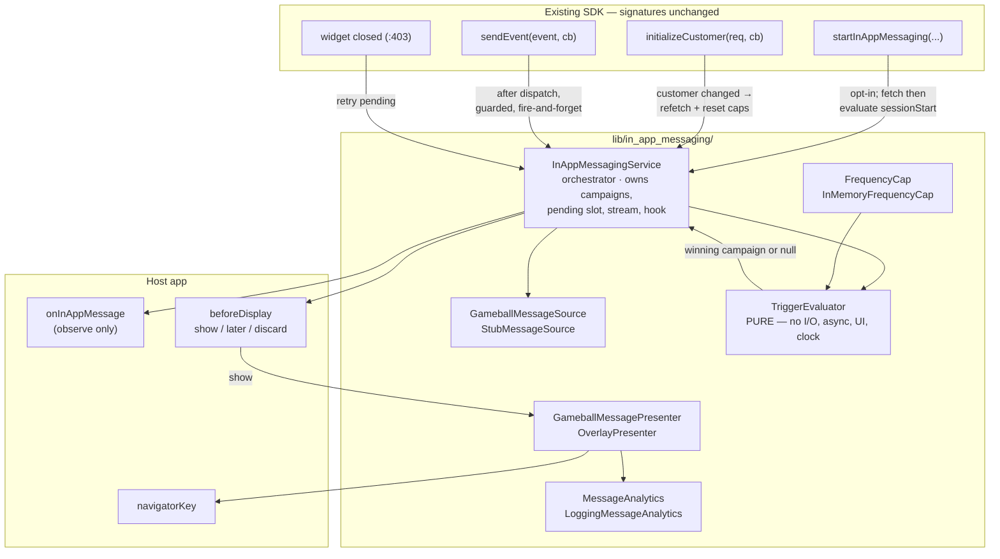

# In-App Messaging MVP — Design

**Status:** approved for planning · **Date:** 2026-08-05 · **Branch:** `feature/in-app-messaging`
**Target SDK version:** 3.2.0 → 3.3.0

## Goal

Add in-app messaging to the Gameball Flutter SDK: **one message type (modal), two triggers
(session start and custom event)**, rendered in Flutter, fed from a stubbed message source.
The module must be a strictly additive capability — existing clients who upgrade and change
nothing must observe no difference.

## Background

Modelled on Braze, researched from source at
[`docs/research/braze-in-app-messaging-reference.md`](../../research/braze-in-app-messaging-reference.md)
(Braze Flutter SDK 21.0.0, commit `ecdde249`). Section references below (§n) point into that
document.

Two facts from that research shape everything here:

1. **Braze's Flutter architecture is not copyable.** Their plugin is a thin bridge over two
   mature native SDKs — trigger engine, templating, asset prefetch, display manager and
   animations are all native. `gameball_sdk` is a **pure-Dart package** (no `android/` or
   `ios/` directory, no `flutter: plugin:` registration, no Kotlin/Swift sources), so there is
   no native layer to delegate display to. Flutter rendering is the only path open — the one
   Braze declined, because Braze already owned native SDKs.
2. **Braze's semantics are copyable, and we copy them.** Trigger types, local evaluation, the
   30-second floor, highest-priority-wins, the message data model, the `extras` escape hatch,
   single-owner analytics, and deferral-with-retry are all taken from Braze rather than invented.

Everything currently in the SDK serves the Gameball widget (`showProfile` →
`_buildWidgetUrl` → `webview_flutter`). It is out of scope and is not modified beyond the
additive hooks listed in §"Compatibility contract".

## Decisions

| Decision | Choice | Rationale |
| --- | --- | --- |
| Message source | Stub first; define the contract we want | No backend endpoint exists or is specced |
| Message type | Modal, rendered in Flutter widgets | Braze's workhorse type; cheapest to build well in Flutter; forces the button/click-action and analytics contracts to be designed now |
| Triggers | Both session start **and** custom event | One generic evaluator; the second trigger is nearly free once the first exists |
| UI-handle acquisition | Global navigator key | Braze's principle — acquire once at setup, never at the call site. Strictly cheaper and more capable than a wrapper widget: the same key yields both a dialog route and an `OverlayState` |
| Draw target | `OverlayEntry` | Braze iOS's own-layer model. Braze's Android choice (host hierarchy) looks like a concession to Android's limits, not a preference; Flutter gives a real overlay for free |
| Identity | `customerId` required now; wire contract shaped as a tagged union | Loyalty messages are customer-scoped. Diverges from Braze (which supports anonymous device-scoped users); a `DeviceAudience` variant stays additive |
| Module shape | Layered pipeline + Braze's control surface | Closes the gap in Braze's own Flutter SDK: `beforeDisplay` and an observation stream are reachable only from XML/Swift in Braze (§11.1), and are Dart-native here |

## Architecture

Two flows, deliberately separate: **fetching never displays, and displaying never fetches.**



**Flow 1 — fetch, once per session.** `startInAppMessaging` → fetch campaigns for the
audience → replace the in-memory campaign list → evaluate the `sessionStart` trigger. Braze's
model: fetch everything eligible up front, then evaluate locally with no further network calls
(§8.2).

**Flow 2 — trigger to display.** `sendEvent` dispatches exactly as today, then additionally
notifies the service with the event name. The service asks the evaluator for a winner, emits it
on `onInAppMessage`, consults `beforeDisplay`, and on `show` hands it to the presenter. The
presenter inserts the `OverlayEntry`, logs the impression, and on a button tap logs the click,
runs the action and dismisses.

### Design properties

1. **The evaluator is a pure function.** All trigger matching, cap enforcement and priority
   ordering is testable with plain data and zero mocking.
2. **Four interfaces, four seams**, each hiding a change we have already named — not
   speculative generality.
3. **Single-owner analytics.** The SDK logs impressions and clicks; the host never does. Braze's
   double-counting hazard (§9.1) designed out rather than documented around.
4. **Existing APIs keep their signatures and behaviour.** Every hook is additive, guarded, and
   a no-op when the module is not started.

## Compatibility contract

**Invariant: a client who upgrades and changes nothing must observe no difference.**

| # | Requirement |
| --- | --- |
| 1 | **Every public type is prefixed `Gameball`.** Adding `export` to `gameball_sdk.dart` injects names into the namespace of every existing importer; generic names like `ClickAction` or `MessageType` could collide with a client's own types. Dart only errors when an ambiguous name is *referenced*, so this would break some clients, not all — still a violation |
| 2 | **Display is suppressed while the Gameball widget is open**, treated as deferral (not discard). Detected via `_dismissActiveWidget != null` (set `gameball_sdk.dart:355`, cleared `:403`) |
| 3 | **`GameballConfig` is untouched.** No new fields — adding a required builder field would break every client |
| 4 | **No new pub dependencies.** `url_launcher`, `shared_preferences` and `webview_flutter` are already declared; a new dependency risks version conflicts in client apps |
| 5 | **Hooks can never throw into existing paths.** Each is wrapped in its own try/catch that logs and swallows, and is invoked *after* dispatch, **outside** the existing `.then()` chains — `sendEvent` and `initializeCustomer` attach `.then()` with no `catchError`, so anything thrown inside those chains escapes as an unhandled async error |
| 6 | **Zero cost when unused.** Stream controller created lazily on first access; no timers, no requests, no state before `startInAppMessaging` |
| 7 | **Version bumped in both places:** `pubspec.yaml:3` and the hardcoded `getSdkVersion()` at `utils/gameball_utils.dart:26`, which feeds the `x-gb-agent` header |
| 8 | **The existing test file keeps passing:** `test/gameball_sdk_test.dart` |

Made checkable, not asserted — see §"Staged validation".

### Files modified in the existing SDK

Only `lib/gameball_sdk.dart`, `pubspec.yaml`, and `lib/utils/gameball_utils.dart`.

In `gameball_sdk.dart`:

- add `startInAppMessaging`, `stopInAppMessaging`, `onInAppMessage`
- add one `export 'in_app_messaging/in_app_messaging.dart';`
- add three guarded, additive notifications: in `initializeCustomer` (customer changed), in
  `sendEvent` (custom event), and where the widget closes at `:403` (retry pending)

## File layout

A feature folder. The existing SDK groups by technical layer, but these files change together
and belong together, and it keeps the module reviewable and replaceable as a unit. No existing
file moves.

```
lib/in_app_messaging/
  in_app_messaging.dart              barrel — public exports only
  in_app_messaging_service.dart      orchestrator; campaigns, pending slot, stream, hook
  models/
    in_app_message.dart              GameballInAppMessage, GameballMessageButton,
                                     GameballClickAction, GameballMessageType, styles
    in_app_message_campaign.dart     id + trigger + priority + message
    message_trigger.dart             sealed GameballMessageTrigger
    gameball_audience.dart           sealed GameballAudience
  source/
    message_source.dart              abstract GameballMessageSource
    message_parser.dart              JSON → campaigns; shared by stub and future HTTP source
    stub_message_source.dart         fixture-backed MVP implementation
  evaluation/
    trigger_evaluator.dart           pure selectCampaign(...)
    frequency_cap.dart               abstract FrequencyCap + InMemoryFrequencyCap + CapState
  presentation/
    message_presenter.dart           abstract GameballMessagePresenter
    overlay_presenter.dart           OverlayEntry impl; owns the scrim
    in_app_message_modal.dart        the modal widget
  analytics/
    message_analytics.dart           abstract MessageAnalytics + LoggingMessageAnalytics
```

## Public API

```dart
void startInAppMessaging({
  required String customerId,
  required GlobalKey<NavigatorState> navigatorKey,
  GameballBeforeDisplay? beforeDisplay,
});

void stopInAppMessaging();                        // logout: clear, dismiss, reset caps

Stream<GameballInAppMessage> get onInAppMessage;  // observation only — no logging methods

typedef GameballBeforeDisplay =
    GameballDisplayDecision Function(GameballInAppMessage message);

enum GameballDisplayDecision { show, later, discard }
```

`beforeDisplay` is synchronous, matching Braze Android's `beforeInAppMessageDisplayed`.

**Not public:** `GameballMessageSource`, `GameballMessagePresenter`, `FrequencyCap` and
`MessageAnalytics` are injected via internal constructor parameters for testing. The seams exist
for our extensibility and our tests; publishing them now would be API we must support.
`beforeDisplay` and `onInAppMessage` are the entire host control surface.

| Seam | MVP implementation | Named future swap |
| --- | --- | --- |
| `GameballMessageSource` | `StubMessageSource` | `HttpMessageSource` when the endpoint lands |
| `GameballMessagePresenter` | `OverlayPresenter` | slideup / banner presenters |
| `FrequencyCap` | `InMemoryFrequencyCap` | `PersistedFrequencyCap` (`SharedPreferences`) |
| `MessageAnalytics` | `LoggingMessageAnalytics` | real impression/click endpoint |

### Types

```dart
sealed class GameballAudience { const GameballAudience(); }
final class CustomerAudience extends GameballAudience {
  const CustomerAudience(this.customerId);
  final String customerId;
}
// later, additive: final class DeviceAudience extends GameballAudience { ... }

sealed class GameballMessageTrigger { const GameballMessageTrigger(); }
final class GameballSessionStartTrigger extends GameballMessageTrigger {
  const GameballSessionStartTrigger();
}
final class GameballCustomEventTrigger extends GameballMessageTrigger {
  const GameballCustomEventTrigger(this.eventName);
  final String eventName;
}

sealed class GameballClickAction { const GameballClickAction(); }
final class GameballDismissAction extends GameballClickAction {
  const GameballDismissAction();
}
final class GameballOpenUrlAction extends GameballClickAction {
  const GameballOpenUrlAction(this.url, {this.external = false});
  final String url;
  final bool external;
}

enum GameballMessageType { modal, unsupported }
```

Sealed throughout, so adding a purchase trigger or a log-event action makes the compiler list
every site that must handle it. Hosts never construct these.

## Message contract

We own both ends, so **styling crosses the boundary** — the one thing Braze structurally cannot
do (their Dart model drops colours, alignment and crop style, §6.2, so a Dart-rendered Braze
message cannot honour dashboard design). Colours are **hex strings**, following the existing
Gameball convention (`ShowProfileRequest.closeButtonColor` is a `String?`) rather than Braze's
packed ARGB integers.

### Fetch

```dart
abstract class GameballMessageSource {
  Future<List<InAppMessageCampaign>> fetch(GameballAudience audience);
}
```

`ApiKey`, `Lang` and `x-gb-agent` already travel in headers via `getRequestHeaders`, so the
request body carries only what is new:

```json
{ "audience": { "type": "customer", "customerId": "customer-123" } }
```

The endpoint path is the backend team's call. What this spec pins down is the response shape.

### Response

```json
{
  "campaigns": [
    {
      "id": "cmp_welcome_modal",
      "priority": 100,
      "trigger": { "type": "session_start" },
      "message": {
        "id": "msg_welcome_v1",
        "type": "modal",
        "header": "Welcome back!",
        "body": "You have 1,250 points ready to redeem.",
        "imageUrl": "https://cdn.gameball.co/campaigns/hero.png",
        "showCloseButton": true,
        "autoDismissAfterMs": null,
        "buttons": [
          {
            "id": 0,
            "text": "Later",
            "action": { "type": "dismiss" },
            "style": { "backgroundColor": "#EEEEEE", "textColor": "#111111", "borderColor": "#DDDDDD" }
          },
          {
            "id": 1,
            "text": "Redeem",
            "action": { "type": "open_url", "url": "myapp://rewards", "external": false },
            "style": { "backgroundColor": "#6C4DF6", "textColor": "#FFFFFF", "borderColor": "#6C4DF6" }
          }
        ],
        "style": {
          "backgroundColor": "#FFFFFF",
          "headerColor": "#111111",
          "bodyColor": "#444444",
          "scrimColor": "#99000000",
          "headerAlign": "center",
          "bodyAlign": "start"
        },
        "extras": { "campaignSource": "loyalty-q3" }
      }
    },
    {
      "id": "cmp_cart_nudge",
      "priority": 50,
      "trigger": { "type": "custom_event", "eventName": "add_to_cart" },
      "message": {
        "id": "msg_cart_v1",
        "type": "modal",
        "body": "Add one more item for 2× points.",
        "showCloseButton": true,
        "buttons": []
      }
    }
  ]
}
```

- **Button style is inline on the button**, not a parallel array — position-indexed styling is
  fragile. Braze does the same.
- **Every `style` field is optional**, falling back to the host's Material theme. A minimal
  campaign is `{id, type, body}` and still renders; richer styling is additive later.
- **`autoDismissAfterMs: null` (or absent) means no auto-dismiss** — the message stays until the
  user dismisses it via a button, the close button or the scrim.
- **`priority` is higher-wins.** `100` beats `50`.
- **`extras`** is the marketer's escape hatch — arbitrary key-values that drive app behaviour
  without a client release. The most-used part of Braze's model (§12.2).
- **No `schemaVersion`.** Optional additive fields cover normal evolution; a version field only
  helps for genuinely breaking changes, which warrant a new endpoint.

### Parsing rules

Rule: **drop what can never work, keep-but-skip what a future SDK might support, never throw.**

| Situation | Behaviour |
| --- | --- |
| Unknown `message.type` | → `GameballMessageType.unsupported`. Campaign **kept**, skipped at display with a log |
| Unknown `trigger.type` | Campaign **dropped** at parse with a log — it can never fire |
| Unknown `action.type` | Button becomes `dismiss` with a log — a working close beats a dead button |
| Missing `id` or `body` | Campaign dropped with a log |
| Malformed colour string | Field ignored, theme default used, logged |
| More than 2 buttons | First 2 kept, logged |
| Non-string `extras` values | **Coerced via `toString()`**, not dropped |
| Whole response malformed | Fetch fails → campaign list left empty, logged, no crash |

Two are deliberate improvements over Braze: `unsupported` instead of a silent `slideup`
fallback (§6.4.1 — a bug Braze shipped twice, `CHANGELOG.md:185-187`), and coercing `extras`
instead of dropping non-strings (§6.4.2).

### Stub strategy

`StubMessageSource` holds the fixture as a **raw JSON string const** and runs it through the
*identical* parser the HTTP source will use.

Two reasons: it needs no `pubspec.yaml` assets section (which the compatibility contract wants
left alone), and every parsing rule above is genuinely exercised from day one. When the endpoint
lands, only the transport changes — `jsonDecode(stubJson)` becomes `jsonDecode(response.body)`,
and the parser and its tests are untouched.

## Evaluation and capping

```dart
/// Pure. No I/O, no async, no BuildContext, no clock.
InAppMessageCampaign? selectCampaign({
  required GameballMessageTrigger trigger,
  required List<InAppMessageCampaign> campaigns,
  required CapState capState,
  required DateTime now,          // injected → deterministic tests
});
```

Selection order: filter by trigger match → drop already-shown → enforce the 30-second floor →
sort by `priority` descending (**higher wins**) → take first. **Ties break on response order**,
deterministic and documented.

**The 30-second floor is global, not per-campaign** — it is the minimum interval between *any*
two message displays, which is why `CapState` carries a single `lastDisplayAt` rather than one
per campaign. This matches Braze's `triggerMinimumTimeInterval`. Per-campaign repeat suppression
is a separate rule: `shownCampaignIds`, once per run.

`now` is a parameter, not `DateTime.now()`, so the floor is testable without waiting.

```dart
class CapState {
  const CapState({required this.shownCampaignIds, required this.lastDisplayAt});
  final Set<String> shownCampaignIds;
  final DateTime? lastDisplayAt;
}

abstract class FrequencyCap {
  Future<void> load();                                  // once at start; no-op in-memory
  CapState snapshot();                                  // sync → evaluator stays pure
  void recordDisplay(String campaignId, DateTime at);
  void reset();                                         // on stop / re-identify
}
```

State is loaded once at start and mutations write through, so when the persisted implementation
arrives `SharedPreferences`' async never leaks into the evaluator.

**A display is recorded at impression, not at selection** — a suppressed or deferred message
must not burn its slot. An `unsupported` type is skipped without burning its cap.

Braze's defaults adopted as-is: 30-second floor, highest-priority-wins, once per campaign
(§8.3).

## Presentation and deferral

`OverlayPresenter` inserts a single `OverlayEntry` via `navigatorKey.currentState!.overlay`,
containing the scrim and the modal. Because the entry is not a route, host `push`/`pop` can
neither cover nor dismiss it — the reason for choosing the overlay.

### Deferral with retry

Deferral must actually retry, or "later" silently means "never until another trigger fires".
Braze's `DISPLAY_LATER` returns the message to the native SDK's stack and the manager retries at
the next display opportunity; this is the equivalent.

```dart
InAppMessageCampaign? _pending;   // single slot; most recent deferral wins

void _tryPresent(InAppMessageCampaign c) {
  final block = _blockReason();   // widgetOpen | noNavigator | alreadyShowing | hostDeferred
  if (block != null) { _pending = c; _log(block); return; }
  _present(c);
}

void _retryPending() {
  final c = _pending;
  if (c == null) return;
  _pending = null;
  if (_capBlocks(c)) { _pending = c; return; }   // re-validate; never bypass the floor
  _tryPresent(c);                                 // may legitimately re-defer
}
```

`_retryPending()` fires at three points: the Gameball widget closing, our own message
dismissing, and the post-frame retry when the navigator was not ready.

- **The floor is re-validated on retry.** Otherwise a message deferred at t=0, with another
  shown at t=35s, would appear at t=40s and break the 30-second rule. If it has since become
  already-shown, it is dropped.
- **`beforeDisplay` returning `later` uses the same slot**, so host-requested deferral and
  internal blocking share one mechanism.
- **Single slot, most recent wins.** Braze keeps a stack; here a displaced older deferral is
  logged and dropped. Cleared on re-identify and on `stopInAppMessaging`.

### Known limitation: Android hardware back

Intercepting Android back for an overlay that is not a route is genuinely awkward in Flutter —
`BackButtonListener` and `PopScope` both require a `Router` or route ancestor, so on a plain
`MaterialApp` a back press pops the *host's* route beneath the message.

This is the real cost of the own-layer choice. Braze confirms it is not free: their Android SDK
implements back handling explicitly and exposes `setBackButtonDismissesInAppMessageView(boolean)`.
Braze iOS gets it free only because a separate `UIWindow` captures interaction naturally.

**MVP position:** the close button and scrim tap are the guaranteed dismissal paths and are
always available; `BackButtonListener` is wired when a `Router` is present; full back
interception on a plain `MaterialApp` is a documented follow-up.

## Analytics

```dart
abstract class MessageAnalytics {
  void logImpression(GameballInAppMessage message, {required String campaignId});
  void logButtonClick(GameballInAppMessage message,
      {required String campaignId, required int buttonId});
}
```

Called only from the presentation path. The `onInAppMessage` stream deliberately has no logging
methods, so the host cannot double-count (§9.1). MVP implementation routes to `GameballLogger`.

## Error handling and edge cases

**Lifecycle**

| Case | Behaviour |
| --- | --- |
| `startInAppMessaging` before `init()` | Log, no-op, no throw — matches existing `isNullOrEmpty(_apiKey)` guards |
| Called twice, same `customerId` | No-op |
| Called again, different `customerId` | Refetch, reset caps, clear pending, dismiss any active message |
| `stopInAppMessaging` when not started | No-op |
| `stopInAppMessaging` while showing | Dismiss, cancel timers, clear all state |
| `sendEvent` before start | Hook no-ops |

**Fetch**

| Case | Behaviour |
| --- | --- |
| Fetch fails | Campaign list left empty, logged, **no retry in the MVP** |
| Trigger fires before first fetch resolves | Finds an empty list, dropped with a debug log. Same as Braze; avoidable by calling `start` early. **No trigger queue-and-replay** |

**Presentation**

| Case | Behaviour |
| --- | --- |
| `navigatorKey.currentState == null` | One retry via `addPostFrameCallback`; if still null, stays pending. Real case — `start` can precede the first frame |
| Gameball widget open | Deferred (contract item 2) |
| A message already showing | Do not stack; the second is deferred |
| Host navigates while showing | Immune by design |
| `autoDismissAfterMs` set | Timer cancelled on manual dismiss and on stop — no double-dismiss |
| Image fails to load | Render without it via `errorBuilder`; never block the message |
| `OpenUrlAction` cannot launch | Log and still dismiss; do not trap the user |
| Overlay removal | Guarded so it happens exactly once |

**Host callbacks**

- `beforeDisplay` throws → catch, log, fall back to `show` (the no-hook default, so least
  surprising).
- `onInAppMessage` listener throws → cannot affect us. `StreamController.broadcast()` delivers
  asynchronously by default, so listener errors stay in the host's zone.

## Testing

**Unit — the bulk, no Flutter binding needed.** The payoff for a pure evaluator.

- `trigger_evaluator_test.dart` — match/no-match per trigger type, priority ordering, tie-break
  determinism, already-shown, the floor at 29.9s and 30.1s (possible only because `now` is
  injected), empty campaign list, `unsupported` skipped without burning a cap
- `message_parser_test.dart` — one test per row of the parsing-rules table
- `frequency_cap_test.dart` — record / snapshot / reset semantics

**Widget**

- `in_app_message_modal_test.dart` — renders header/body/image/buttons; button taps invoke their
  actions; close dismisses; styling applied; missing image degrades cleanly
- `overlay_presenter_test.dart` — exactly one entry inserted and removed; auto-dismiss fires;
  timer cancelled on manual dismiss

**Service**

- `in_app_messaging_service_test.dart` — lifecycle table above; deferral and retry, including
  floor re-validation on retry; `beforeDisplay` decisions including a throwing hook

**Compatibility — the invariant, made checkable**

- With no `startInAppMessaging` call: assert no fetch occurs and no overlay is inserted
- Widget-open suppression, then display on widget close

## Staged validation in the sample app

Sibling project `gameball-sample-app` consumes the SDK by path. It currently has **zero** widget
usage, so stage 2 adds it — which is what makes the coexistence test real.

| Stage | Sample app state | What it proves |
| --- | --- | --- |
| **0. Baseline** | Untouched — no `navigatorKey`, no `startInAppMessaging`, no widget | The compatibility invariant. Behaviour identical, no fetch, no overlay |
| **1. IAM alone** | Add `navigatorKey`; start IAM from the debug screen | The MVP goal: session-start modal on start, `add_to_cart` modal from the existing product-details button. The new-client story |
| **2. Widget alone** | Add `showProfile` — a Gameball button on Home, as clients use it today. IAM **not** started | The widget path behaves exactly as it does now, on the new version. Isolates widget regressions from IAM ones |
| **3. Both together** | Widget **and** IAM active | The existing-client story |

Stage 3 checks, in order:

1. Trigger a message with the widget **closed** → shows normally
2. Open the widget, trigger `add_to_cart` → message deferred, widget undisturbed, debug screen
   shows it pending
3. Close the widget → **pending message appears** (without the deferral fix this silently fails)
4. Message showing, then open the widget → widget opens over it; no visual fight, no
   double-dismiss
5. Two campaigns eligible at once → only the higher priority shows, and the floor holds

The debug screen gains: IAM started y/n, campaigns loaded, last decision, cap state, pending
message, and an impression/click log.

## Out of scope

Named so the implementation plan cannot drift into them:

- Other message types: slideup, fullscreen, HTML
- Persisted caps across launches (`PersistedFrequencyCap`)
- Anonymous / device-scoped audience (`DeviceAudience`)
- The real HTTP message source and endpoint
- Fetch retry / backoff
- Liquid templating, Connected Content, asset prefetch
- A real impression/click analytics endpoint
- Trigger queue-and-replay before the first fetch resolves
- Full Android back interception on a plain `MaterialApp`
- Fixing the pre-existing `.then()`-without-`catchError` defect in `initializeCustomer` and
  `sendEvent` (separate change; this work must not make it worse)

## Open questions

1. **Endpoint contract.** The response shape here is our proposal. It needs backend agreement
   before `HttpMessageSource` is written; nothing in the MVP depends on the answer.
2. **Native SDK parity.** If Gameball's native Android/iOS SDKs already implement in-app
   messaging, their message schema, trigger semantics and analytics events are the contract to
   match, and this design should be reconciled with them.
